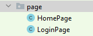
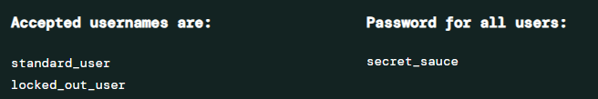

# Automatización de WEB - Selenium + Serenity

### Este es un proyecto basado en:

- Maven
- Java
- SerenityBDD
- JUnit5
- Selenium

### ¡IMPORTANTE! Lee atentamente las indicaciones del ejercicio.

Página se usurá para el desafio de automatización WEB<br>
Ingresa a la siguiente página y familiarizate con el Front End.<br>

#### -> https://www.saucedemo.com/

**Saucedemo.com** es un sitio web que expone un formulario Login, utilizado para hacer prueba básicas de automatización web.<br>

**- Para este ejercicio, se está usando el driver nativo de Selenium, por lo tanto, no es necesario descargar ningún driver.**<br>
**- Utiliza chrome como navegador para inspeccionar los elementos y obtener los localizadores necesarios.**

### Descripción del ejercicio

### ===> Recomendaciones Importantes

1. El proyecto ya tiene código desarrollado reutilizable, por lo tanto, **reutilicemos métodos y variables** existentes.
2. Debes completar los siguientes **'@Test'** que se encuentran en la clase **'SauceDemoTest.java'** para que funcionen:

```java
//CASO 1 - Validar que la URL de la página de inicio de sesión es la correcta.
@Test
public void validarUrlCorrecta(){}

//CASO 2 - Validar que la URL de HOME aparece cuando inicio sesión con las credenciales correctas.
@Test
public void validarLoginOK(){}

//CASO 2 - Validar el mensaje de error esperado aparece cuando inicio sesión con credenciales bloqueadas.
@Test
public void validarErrorUsuarioBloqueado(){}
```
4. El Driver ya es creado por el proyecto de automatización. 
5. Está ejecución es de tipo HeadLess, por lo tanto, todo se ejecutar en background.**
6. El proyecto tiene ciertos incidentes que nos llevarán al error. **Corrijamos estos incidentes para continuar.**
7. **_Ayuda:_** 
   5. Inspecciona la página sujeta a pruebas e indentifica los localizadores necesarios.
   6. Reutiliza las clases de tipo PageObject, reutiliza los métodos y elementos declarados.

      

8. Dentro de la página, en la parte inferior encontrarás las credenciales:

      

9. Puedes revisar también el archivo [credenciales.txt](src%2Ftest%2Fresources%2Fcredenciales.txt)

### ===> Desafio

1. Ingresa a la página para inspeccionar los elementos necesarios ** -> https://www.saucedemo.com/**
2. Se solicita instrumentalizar el formulario de Inicio de Sesión. **Correcto e Incorrecto.**

3. Una vez que hayamos identificados todos los elementos:
   4. **Validar que estamos en la página de inicio de sesión** (CASO1)
   5. **Iniciar sesión con las credenciales correctas y validar que me encuentro en la página Home** (CASO2)
   6. **Iniciar sesión con el ususario bloqueado y validar que el mensaje de error es el esperado** (CASO3)


### Por último ...

#### 1. Lee bien los comentarios que existen en el proyecto, esto te ayudará a ubicarte y te permitirá empezar a resolver el ejercicios.
#### 2. Ejecuta y valida los test en su totalidad con ayuda del comando:

```
$ mvn clean test
```

#### 3. Una vez que hayas terminado con los desafios, no te olvides de publicar tus cambios con Git, de lo contrario, no podrán ser evaluados:<br>
Utiliza la siguiente secuencia de comandos
```
$ git add .
$ git commit -m "solution"
$ git push
```
